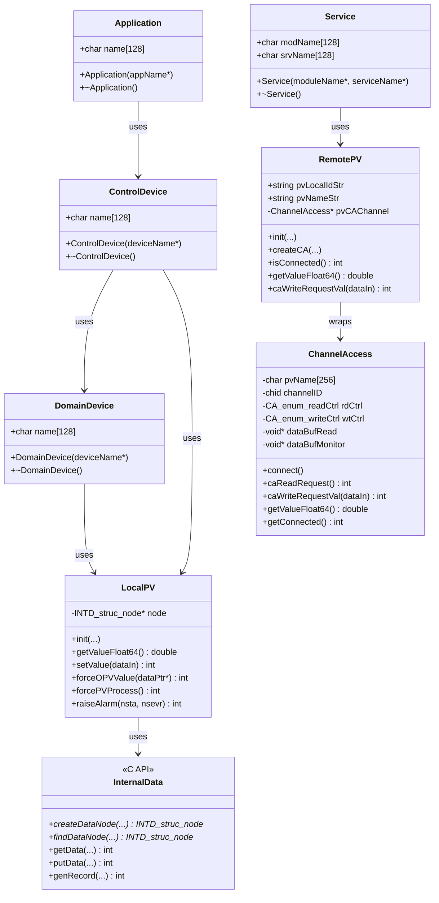
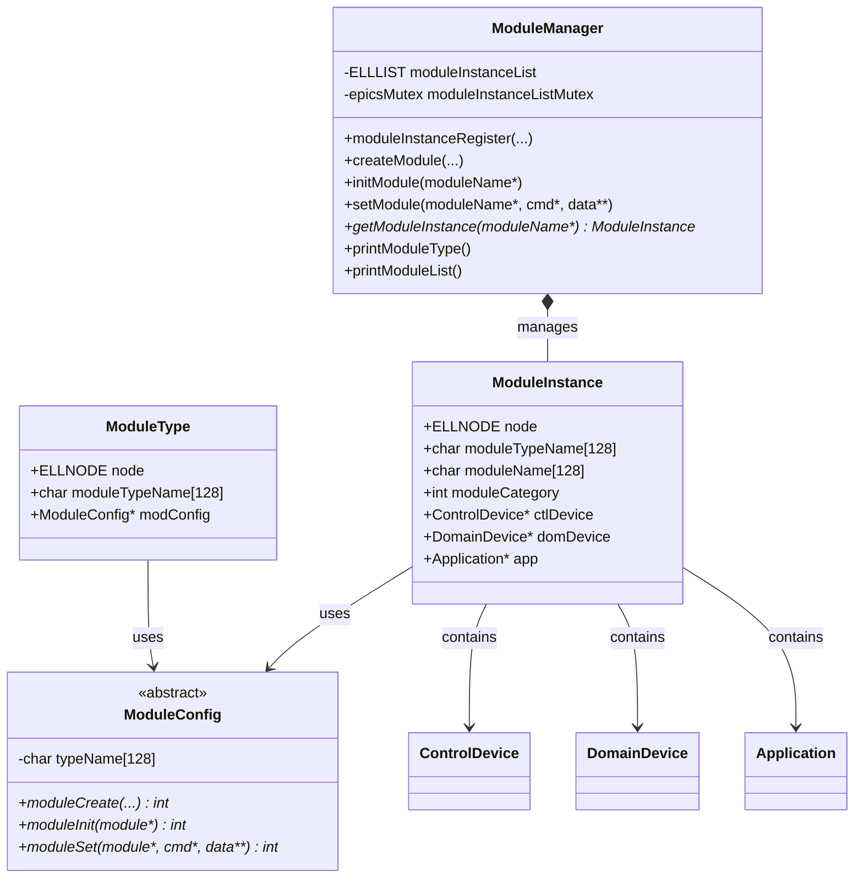
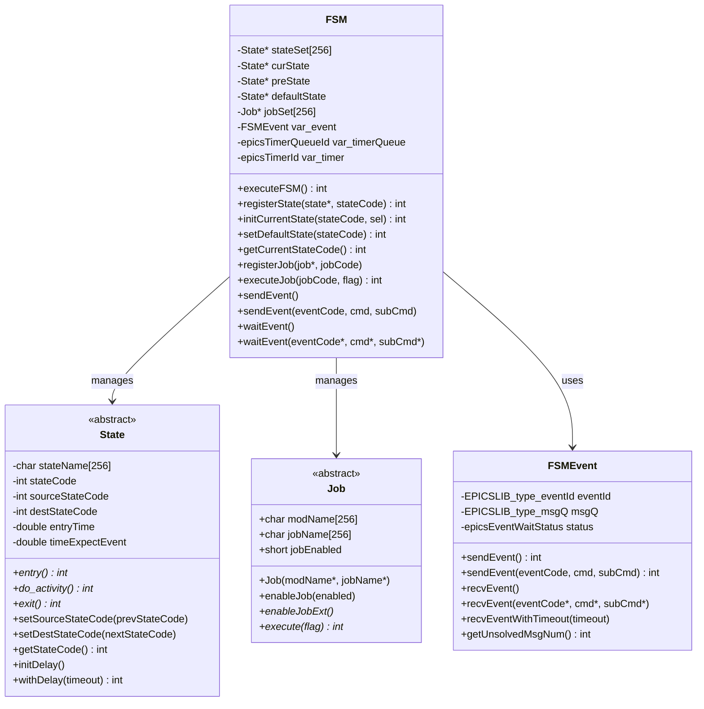
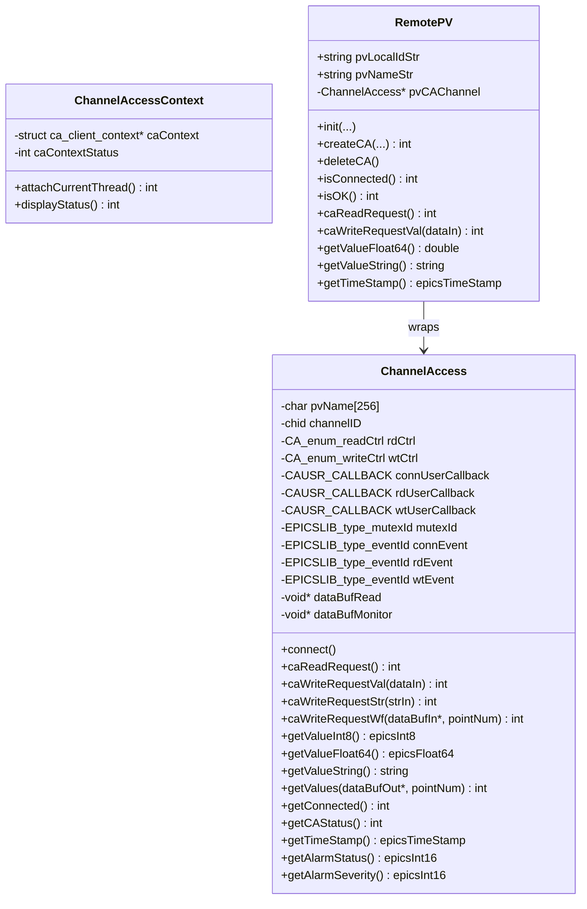
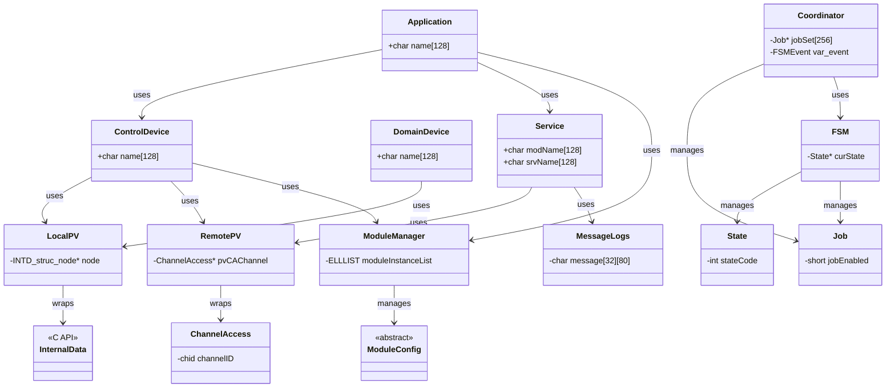

# ooEpicsApp Source Code Documentation

**Author:** Generated Documentation  
**Date:** 2026-01-01  
**Source:** C:\Aqiao\Code_public\ooEpics\ooEpicsApp\src

---

## Table of Contents

1. [Architecture Overview](#architecture-overview)
2. [System Layers](#system-layers)
3. [UML Class Diagrams](#uml-class-diagrams)
4. [C++ Classes Documentation](#c-classes-documentation)
5. [C Routines Documentation](#c-routines-documentation)
6. [Usage Patterns](#usage-patterns)

---

## Architecture Overview

The ooEpicsApp is an Object-Oriented framework for building EPICS Input/Controller (IOC) applications. It provides a layered architecture that separates concerns between EPICS record management, device control, and application logic.

### Key Design Principles

- **Separation of Concerns:** Clear separation between EPICS records (InternalData), device abstraction (ControlDevice/DomainDevice), and application logic (Application/Service/Job)
- **Object-Oriented Wrapper:** C++ OO wrapper around C-based EPICS APIs
- **Modular Design:** Module-based architecture with dynamic module creation and configuration
- **State Machine Support:** Built-in Finite State Machine (FSM) framework for control logic
- **Channel Access Abstraction:** OO wrapper around EPICS Channel Access for remote PV communication

---

## System Layers

The ooEpicsApp framework consists of four distinct layers:

### Layer 1: EPICS Record Layer (InternalData)
**Purpose:** Isolation layer between EPICS records and internal code

**Key Components:**
- `INTD_struc_node`: Data structure linking internal data to EPICS records
- C API functions: `INTD_API_*`
- Record generation capabilities

**Responsibilities:**
- Manage EPICS record creation and linking
- Handle data transfer between internal variables and EPICS records
- Support callbacks for read/write operations
- Generate database files (.db) automatically
- Generate autosave request files (.req)
- Generate archiver configuration files

### Layer 2: Device Abstraction Layer
**Purpose:** Abstract physical and control devices

**Key Components:**
- `ControlDevice`: Base class for control system instrumentation
- `DomainDevice`: Base class for physical devices in specific domains
- `LocalPV`: OO wrapper for local EPICS PVs
- `RemotePV`: OO wrapper for remote EPICS PVs via Channel Access

**Responsibilities:**
- Provide device abstraction interfaces
- Handle both local and remote Process Variables (PVs)
- Support various data types and record types
- Manage Channel Access connections

### Layer 3: Application Framework Layer
**Purpose:** High-level application and service management

**Key Components:**
- `Application`: Base class for high-level applications
- `Service`: Service class for data collection and processing
- `Job`: Job class for procedures and tasks
- `Coordinator`: Job execution coordinator
- `FSM`: Finite State Machine framework
- `State`: FSM state base class

**Responsibilities:**
- Manage application lifecycle
- Coordinate job execution
- Provide state machine capabilities
- Handle event-driven programming

### Layer 4: System Management Layer
**Purpose:** Module and system-level management

**Key Components:**
- `ModuleManager`: Manages module types and instances
- `ModuleConfig`: Configuration API for module types
- `ModuleType`: Module type definition
- `ModuleInstance`: Module instance definition
- `ChannelAccess`: Channel Access wrapper
- `ChannelAccessContext`: CA context management
- `MessageLogs`: Message logging facility

**Responsibilities:**
- Module registration and lifecycle management
- Dynamic module creation
- Channel Access context and connection management
- System-wide logging

### Layer Interaction

```
┌─────────────────────────────────────────────────────────┐
│          Layer 4: System Management                     │
│  ModuleManager, ModuleConfig, ChannelAccess, etc.       │
└─────────────────────┬───────────────────────────────────┘
                      │
┌─────────────────────┴───────────────────────────────────┐
│          Layer 3: Application Framework                 │
│  Application, Service, Job, Coordinator, FSM            │
└─────────────────────┬───────────────────────────────────┘
                      │
┌─────────────────────┴───────────────────────────────────┐
│          Layer 2: Device Abstraction                    │
│  ControlDevice, DomainDevice, LocalPV, RemotePV         │
└─────────────────────┬───────────────────────────────────┘
                      │
┌─────────────────────┴───────────────────────────────────┐
│          Layer 1: EPICS Record Layer                    │
│  InternalData (C API), INTD_struc_node                  │
└─────────────────────┬───────────────────────────────────┘
                      │
              ┌───────┴───────┐
              │   EPICS IOC   │
              │   Database    │
              └───────────────┘
```

---

## UML Class Diagrams

### Main Class Relationships



### Module Management Classes



### FSM Framework Classes



### Channel Access Classes



### Complete System Architecture



---

## C++ Classes Documentation

### Application Class

**File:** `Common/Application.h`, `Common/Application.cc`  
**Namespace:** `OOEPICS`

**Purpose:** Base class for high-level applications in the ooEpics framework.

**Attributes:**
- `char name[OOEPICS_NAMESTR_LEN]`: Name of the application

**Methods:**
- `Application(const char *appName)`: Constructor that initializes the application with a name
- `virtual ~Application()`: Virtual destructor

**Description:**
The Application class serves as a base class for high-level application logic. It's typically used to encapsulate application-wide functionality and is managed by the ModuleManager. Applications can be created, initialized, and configured dynamically through the module system.

**Usage Example:**
```cpp
class MyApplication : public OOEPICS::Application {
public:
    MyApplication(const char *appName) : Application(appName) {
        // Initialize application-specific resources
    }
    
    ~MyApplication() {
        // Cleanup
    }
};
```

---

### ControlDevice Class

**File:** `Common/ControlDevice.h`  
**Namespace:** `OOEPICS`

**Purpose:** Base class for instrumentation devices inserted by the control system for control purposes.

**Attributes:**
- `char name[OOEPICS_NAMESTR_LEN]`: Name of the control device

**Methods:**
- `ControlDevice(const char *deviceName)`: Constructor
- `virtual ~ControlDevice()`: Virtual destructor

**Description:**
ControlDevice represents devices that are controlled by the control system. This is a base class that should be derived to create specific control device implementations. Control devices are typically managed by the ModuleManager and can be created dynamically.

**Usage Example:**
```cpp
class MyControlDevice : public OOEPICS::ControlDevice {
public:
    MyControlDevice(const char *deviceName) : ControlDevice(deviceName) {
        // Device initialization
    }
};
```

---

### DomainDevice Class

**File:** `Common/DomainDevice.h`  
**Namespace:** `OOEPICS`

**Purpose:** Base class for physical devices in specific domains that need to be finally controlled.

**Attributes:**
- `char name[OOEPICS_NAMESTR_LEN]`: Name of the domain device

**Methods:**
- `DomainDevice(const char *deviceName)`: Constructor
- `virtual ~DomainDevice()`: Virtual destructor

**Description:**
DomainDevice represents physical devices in specific technical domains (e.g., RF, vacuum, motion control). These are the actual hardware or physical entities that need to be controlled. Like ControlDevice, this is a base class for deriving specific domain device implementations.

---

### LocalPV Class

**File:** `Common/LocalPV.h`  
**Namespace:** `OOEPICS`

**Purpose:** Object-Oriented wrapper for local EPICS Process Variables (PVs).

**Key Attributes:**
- `INTD_struc_node *node`: Internal data node linking to EPICS record
- Various configuration attributes (module name, data name, record type, scan type, etc.)

**Key Methods:**

**Initialization:**
- `void init(string moduleName, string devName, string valName, ...)`: Initialize the local PV with parameters

**Value Operations:**
- `epicsFloat64 getValueFloat64()`: Get value with data conversion
- `epicsInt32 getValueInt32()`: Get integer value
- `int setValue(epicsFloat64 dataIn)`: Set value with data conversion
- `int setString(string strIn)`: Set string value

**Waveform Operations:**
- `int getValues(epicsFloat64 *dataOut, unsigned int pointNum)`: Get waveform values
- `int setValues(epicsFloat64 *dataIn, unsigned int pointNum)`: Set waveform values

**Control Operations:**
- `int forceOPVValue(void *dataPtr)`: Force output PV value and process
- `int forcePVProcess()`: Force PV to be processed
- `int raiseAlarm(epicsEnum16 nsta, epicsEnum16 nsevr)`: Raise an alarm
- `int setTimeStamp(epicsTimeStamp tsIn)`: Set timestamp

**Record Configuration:**
- `int setDesc(const char *descStr)`: Set description
- `int setPrec(unsigned int prec)`: Set display precision
- `int setAlias(const char *aliasStr)`: Set alias
- `int setAsg(const char *asgStr)`: Set security group

**Description:**
LocalPV provides an OO interface to local EPICS records. It wraps the InternalData C API and provides type-safe methods for getting and setting values. It supports scalar and array data types, various record types (AI, AO, BI, BO, etc.), and different scan mechanisms (passive, I/O interrupt, periodic).

**Supported Data Types:**
- epicsInt8, epicsUInt8
- epicsInt16, epicsUInt16
- epicsInt32, epicsUInt32
- epicsFloat32, epicsFloat64
- String

**Supported Record Types:**
- AI/AO: Analog Input/Output
- BI/BO: Binary Input/Output
- LI/LO: Long Input/Output
- MBBI/MBBO: Multi-bit Binary Input/Output
- WFI/WFO: Waveform Input/Output
- SI/SO: String Input/Output

---

### RemotePV Class

**File:** `Common/RemotePV.h`  
**Namespace:** `OOEPICS`

**Purpose:** Object-Oriented wrapper for remote EPICS PVs accessed via Channel Access.

**Key Attributes:**
- `string pvLocalIdStr`: Local ID string for the PV
- `string pvNameStr`: EPICS PV name
- `ChannelAccess *pvCAChannel`: Channel Access channel

**Key Methods:**

**Initialization:**
- `void init(string modName, string srvName, string localIDStr, RemotePVList *pvList)`: Initialize remote PV
- `int createCA(unsigned long reqElemsReadIn, CA_enum_readCtrl rdCtrlIn, ...)`: Create Channel Access connection

**Connection Management:**
- `void deleteCA()`: Delete Channel Access connection
- `int isConnected()`: Check if connected
- `int isOK()`: Check if status is OK

**Read Operations:**
- `int caReadRequest()`: Request data read
- `epicsFloat64 getValueFloat64()`: Get scalar value
- `int getValueString(char *strOut)`: Get string value
- `int getValues(epicsFloat64 *dataBufOut, unsigned long pointNum)`: Get waveform values

**Write Operations:**
- `int caWriteRequestVal(epicsFloat64 dataIn)`: Write scalar value
- `int caWriteRequestStr(string strIn)`: Write string value
- `int caWriteRequestWf(epicsFloat64 *dataBufIn, unsigned long pointNum)`: Write waveform

**Status Information:**
- `epicsTimeStamp getTimeStamp()`: Get timestamp
- `epicsInt16 getAlarmStatus()`: Get alarm status
- `epicsInt16 getAlarmSeverity()`: Get alarm severity

**Description:**
RemotePV provides an OO interface to remote EPICS PVs via Channel Access. It wraps the ChannelAccess class and provides type-safe methods for reading and writing remote PVs. It supports various reading modes (pull, callback, monitor) and writing modes.

**Reading Control Modes:**
- `CA_READ_DISABLED`: Reading disabled
- `CA_READ_PULL`: Pull mode - read on request
- `CA_READ_CALLBACK`: Callback mode - callback after read
- `CA_READ_MONITOR`: Monitor mode - automatic updates

**Writing Control Modes:**
- `CA_WRITE_DISABLED`: Writing disabled
- `CA_WRITE_PULL`: Pull mode - write on request
- `CA_WRITE_CALLBACK`: Callback mode - callback after write

---

### RemotePVList Class

**File:** `Common/RemotePV.h`  
**Namespace:** `OOEPICS`

**Purpose:** Manages lists of remote PV names and PV nodes.

**Key Methods:**
- `int getPVNameList(string fileName, string localMacros)`: Load PV name mappings from file
- `int addPVNodeList(RemotePV *pv)`: Add a remote PV to the node list
- `int mapPVNodeNames(string macros)`: Map PV names with macros
- `void prtPVNameList()`: Print PV name list
- `void prtPVNodeList()`: Print PV node list

**Description:**
RemotePVList manages two related lists:
1. **pvNameList**: List of PV name mappings read from configuration files
2. **pvNodeList**: List of actual RemotePV objects

This allows for flexible configuration where PV names can be specified with macros and mapped at runtime.

---

### ChannelAccess Class

**File:** `Common/ChannelAccess.h`  
**Namespace:** `OOEPICS`

**Purpose:** Object-Oriented wrapper around EPICS Channel Access API.

**Key Attributes:**
- `char pvName[CA_STRING_LEN]`: Remote PV name
- `chid channelID`: Channel ID
- `CA_enum_readCtrl rdCtrl`: Reading control mode
- `CA_enum_writeCtrl wtCtrl`: Writing control mode
- `void *dataBufRead`: Buffer for reading data
- `void *dataBufMonitor`: External buffer for monitored data

**Key Methods:**

**Connection:**
- `void connect()`: Setup connection managed by callback

**Read Operations:**
- `int caReadRequest()`: Request data read
- `epicsFloat64 getValueFloat64()`: Get scalar value (with type conversion)
- `int getValueString(char *strOut)`: Get string value
- `int getValues(epicsFloat64 *dataBufOut, unsigned long pointNum)`: Get waveform values
- `int getValuesRaw(void *dataBufOut, unsigned long pointNum)`: Get values without conversion

**Write Operations:**
- `int caWriteRequestVal(epicsFloat64 dataIn)`: Write scalar value
- `int caWriteRequestStr(string strIn)`: Write string value
- `int caWriteRequestWf(epicsFloat64 *dataBufIn, unsigned long pointNum)`: Write waveform with conversion
- `int caWriteRequestWfRaw(void *dataBufIn, unsigned long pointNum)`: Write waveform without conversion

**Status:**
- `int getConnected()`: Get connection status
- `int getCAStatus()`: Get CA status
- `epicsTimeStamp getTimeStamp()`: Get timestamp
- `epicsInt16 getAlarmStatus()`: Get alarm status
- `epicsInt16 getAlarmSeverity()`: Get alarm severity
- `unsigned long getRPVElemCount()`: Get PV element count

**Description:**
ChannelAccess wraps the EPICS Channel Access C API into an OO interface. It manages CA connections, callbacks, and data transfer. It supports various reading and writing modes, data type conversion, and provides status information.

**Callback Mechanism:**
- Connection callback: Called when connection state changes
- Read callback: Called after read completes
- Write callback: Called after write completes

User callbacks can be specified during construction and will be invoked by the generic callback functions.

---

### ChannelAccessContext Class

**File:** `Common/ChannelAccess.h`  
**Namespace:** `OOEPICS`

**Purpose:** Manages Channel Access context for multi-threaded applications.

**Key Methods:**
- `ChannelAccessContext(CA_enum_contextCtrl contextCtrl)`: Constructor
- `int attachCurrentThread()`: Attach current thread to CA context
- `int displayStatus()`: Display CA context status

**Description:**
ChannelAccessContext manages CA contexts, which are required for multi-threaded CA applications. In single-threaded mode, the default context is used. In multi-threaded mode, each thread must be attached to a CA context.

---

### Job Class

**File:** `Common/Job.h`  
**Namespace:** `OOEPICS`

**Purpose:** Base class for jobs/procedures in applications.

**Attributes:**
- `char modName[JOB_STRING_LEN]`: Module name
- `char jobName[JOB_STRING_LEN]`: Job name
- `volatile short jobEnabled`: Job enable flag (1 = enabled, 0 = disabled)

**Methods:**
- `Job(const char *modNameIn, const char *jobNameIn)`: Constructor
- `virtual ~Job()`: Virtual destructor
- `void enableJob(short enabled)`: Enable or disable the job
- `virtual void enableJobExt() = 0`: Extended enable function (to be implemented by user)
- `virtual int execute(int flag) = 0`: Execute the job (pure virtual)

**Description:**
Job represents a procedure or task that can be executed. Jobs can be enabled/disabled and are managed by Coordinators or FSMs. The execute method must be implemented by derived classes to provide the actual job logic.

**Usage Example:**
```cpp
class MyJob : public OOEPICS::Job {
public:
    MyJob(const char *modName, const char *jobName) 
        : Job(modName, jobName) {}
    
    void enableJobExt() override {
        // Extended enable logic
    }
    
    int execute(int flag) override {
        // Job execution logic
        return 0;
    }
};
```

---

### Service Class

**File:** `Common/Service.h`  
**Namespace:** `OOEPICS`

**Purpose:** Base class for services that collect data and processing algorithms for devices.

**Attributes:**
- `char modName[OOEPICS_NAMESTR_LEN]`: Module name
- `char srvName[OOEPICS_NAMESTR_LEN]`: Service name

**Methods:**
- `Service(const char *moduleName, const char *serviceName)`: Constructor
- `~Service()`: Destructor

**Description:**
Service represents a logical grouping of data collection and processing for a device. Services typically define remote PVs and contain the algorithms for processing device data. Services are higher-level constructs that coordinate multiple PVs and processing logic.

---

### Coordinator Class

**File:** `Common/Coordinator.h`  
**Namespace:** `OOEPICS`

**Purpose:** Coordinator for job execution.

**Attributes:**
- `char modName[CRD_STRING_LEN]`: Module name
- `char crdName[CRD_STRING_LEN]`: Coordinator name
- `Job *jobSet[CRD_MAX_NUM_JOBS]`: Array of registered jobs
- `FSMEvent var_event`: Event for this coordinator

**Methods:**
- `Coordinator(const char *modNameIn, const char *crdNameIn)`: Constructor
- `virtual ~Coordinator()`: Virtual destructor
- `virtual int execute() = 0`: Execute the coordinator (pure virtual)
- `void registerJob(Job *job, int jobCode)`: Register a job
- `int executeJob(int jobCode, int flag)`: Execute a specific job
- `void enableAllJobs(int enabled)`: Enable/disable all jobs
- `void enableJob(int jobCode, int enabled)`: Enable/disable a specific job
- `void sendEvent()`: Send event
- `void sendEvent(int eventCode, int cmd, int subCmd)`: Send event with parameters
- `void waitEvent()`: Wait for event
- `void waitEvent(int *eventCode, int *cmd, int *subCmd)`: Wait for event and retrieve parameters

**Description:**
Coordinator manages and coordinates the execution of multiple jobs. It provides event-based communication and can execute jobs based on events or directly. Coordinators are useful for orchestrating complex sequences of operations.

---

### State Class

**File:** `Common/FSM.h`  
**Namespace:** `OOEPICS`

**Purpose:** Base class for FSM (Finite State Machine) states.

**Attributes:**
- `char stateName[FSM_STRING_LEN]`: State name
- `int stateCode`: State code
- `int sourceStateCode`: Source state code for transition
- `int destStateCode`: Destination state code for transition
- `double entryTime`: Time when state was entered
- `double timeExpectEvent`: Expected time for next event

**Methods:**
- `State(int stateCodeIn, const char *stateNameIn)`: Constructor
- `virtual ~State()`: Virtual destructor
- `virtual int entry() = 0`: Entry function (pure virtual)
- `virtual int do_activity() = 0`: Activity function (pure virtual)
- `virtual int exit() = 0`: Exit function (pure virtual)
- `void setSourceStateCode(int prevStateCode)`: Set source state
- `void setDestStateCode(int nextStateCode)`: Set destination state
- `int getStateCode()`: Get state code
- `void initDelay()`: Initialize delay timer
- `int withDelay(double timeout)`: Check if delay timeout expired
- `double getTimeExpectEvent()`: Get expected event time
- `void clearTimeExpectEvent()`: Clear expected event time

**Description:**
State represents a state in a finite state machine. Each state has three key methods:
- `entry()`: Called when entering the state
- `do_activity()`: Called while in the state to perform activities and check for transitions
- `exit()`: Called when leaving the state

States support delayed transitions and can specify expected event times.

---

### FSM Class

**File:** `Common/FSM.h`  
**Namespace:** `OOEPICS`

**Purpose:** Finite State Machine framework for control logic.

**Attributes:**
- `char modName[FSM_STRING_LEN]`: Module name
- `char fsmName[FSM_STRING_LEN]`: FSM name
- `State *stateSet[FSM_MAX_NUM_STATES]`: Array of registered states
- `State *curState`: Current state
- `State *preState`: Previous state
- `State *defaultState`: Default state (to avoid deadlocks)
- `Job *jobSet[FSM_MAX_NUM_JOBS]`: Array of registered jobs
- `FSMEvent var_event`: Event for this FSM
- `epicsTimerQueueId var_timerQueue`: Timer queue
- `epicsTimerId var_timer`: Timer

**Methods:**

**State Management:**
- `int registerState(State *state, int stateCode)`: Register a state
- `int initCurrentState(int stateCode, int sel)`: Initialize current state
- `int setDefaultState(int stateCode)`: Set default state
- `int getCurrentStateCode()`: Get current state code

**Execution:**
- `int executeFSM()`: Execute the FSM (main loop)
- `virtual int initFSM() = 0`: Initialize FSM (pure virtual)
- `virtual int executeExtFunc() = 0`: Extended execution function (pure virtual)

**Job Management:**
- `void registerJob(Job *job, int jobCode)`: Register a job
- `int executeJob(int jobCode, int flag)`: Execute a job
- `void enableAllJobs(int enabled)`: Enable/disable all jobs
- `void enableJob(int jobCode, int enabled)`: Enable/disable a job

**Event Handling:**
- `void sendEvent()`: Send event
- `void sendEvent(int eventCode, int cmd, int subCmd)`: Send event with parameters
- `void waitEvent()`: Wait for event
- `void waitEvent(int *eventCode, int *cmd, int *subCmd)`: Wait for event and retrieve parameters
- `void waitEventWithTimeout(double timeout)`: Wait with timeout
- `int withPendingEvents()`: Check if events pending
- `int isMsgQFull()`: Check if message queue is full

**Description:**
FSM provides a complete finite state machine implementation. It manages states, transitions, and event-based communication. FSMs can also execute jobs, making them suitable as control engines. The FSM executes a main loop that calls the current state's do_activity() method, which can trigger state transitions.

**Execution Return Codes:**
- `FSM_EXE_SUCCESS`: Execution successful
- `FSM_EXE_ERR_ENTRY_FAIL`: Entry function failed
- `FSM_EXE_ERR_NOTRANS`: Destination state invalid, no transition
- `FSM_EXE_ERR_TODEFAULT`: Transition to default state
- `FSM_EXE_ERR_TO1STVALID`: Transition to first valid state
- `FSM_EXE_ERR_TRANS_FAIL`: Transition failed

---

### FSMEvent Class

**File:** `Common/FSM.h`  
**Namespace:** `OOEPICS`

**Purpose:** Event handling for FSM.

**Methods:**
- `int sendEvent()`: Send simple event
- `int sendEvent(int eventCodeIn, int cmdIn, int subCmdIn)`: Send event with parameters
- `void recvEvent()`: Receive event
- `void recvEvent(int *eventCodeOut, int *cmdOut, int *subCmdOut)`: Receive event with parameters
- `void recvEventWithTimeout(double timeout)`: Receive with timeout
- `int getUnsolvedMsgNum()`: Get number of unsolved messages

**Description:**
FSMEvent provides event-based communication using EPICS events and message queues. Events can carry event codes, commands, and sub-commands for flexible communication.

---

### MessageLogs Class

**File:** `Common\MessageLogs.h`  
**Namespace:** `OOEPICS`

**Purpose:** Message logging facility.

**Attributes:**
- `char modName[MSGLOG_STR_LEN]`: Module name
- `char message[MSGLOG_MAX_NUM][MSGLOG_MAX_LEN]`: Message buffer
- `string msgStr[MSGLOG_MAX_NUM]`: String messages
- `int curStr`: Current message index

**Methods:**
- `MessageLogs(const char *modNameIn)`: Constructor
- `~MessageLogs()`: Destructor
- `void postMessage(char *msg)`: Post a message
- `void copyMessage(char *dest, int id)`: Copy a message
- `void printMessage()`: Print messages

**Description:**
MessageLogs provides a simple logging mechanism for storing and retrieving messages. It maintains a circular buffer of messages with thread-safe access.

---

### ModuleManager Class

**File:** `Common/ModuleManager.h`  
**Namespace:** `OOEPICS`

**Purpose:** Manages module types and instances in the ooEpics framework.

**Attributes:**
- `ELLLIST moduleInstanceList`: List of module instances
- `epicsMutex moduleInstanceListMutex`: Mutex for thread-safe operations

**Methods:**

**Instance Management:**
- `void moduleInstanceRegister(const char *moduleTypeName, ModuleConfig *modConfig, const char *moduleName, void *module, int modCategory)`: Register a module instance

**Global Interfaces (called from IOC startup script):**
- `void createModule(const char *moduleTypeName, const char *moduleName, const char *moduleInfo, int priority)`: Create a module instance
- `void initModule(const char *moduleName)`: Initialize a module instance
- `void setModule(const char *moduleName, const char *cmd, char **data)`: Configure a module instance

**Search:**
- `ModuleInstance *getModuleInstance(const char *moduleName)`: Get module instance by name

**Debug:**
- `void printModuleType()`: Print registered module types
- `void printModuleList()`: Print module instances

**Description:**
ModuleManager is the central component for managing module lifecycle. It maintains lists of module types and instances, and provides APIs for creating, initializing, and configuring modules dynamically from IOC startup scripts.

---

### ModuleConfig Class

**File:** `Common\ModuleConfig.h`  
**Namespace:** `OOEPICS`

**Purpose:** Base class for module configuration.

**Attributes:**
- `char typeName[128]`: Module type name

**Methods:**
- `ModuleConfig(const char *moduleTypeName)`: Constructor
- `virtual ~ModuleConfig()`: Virtual destructor
- `virtual int moduleCreate(const char *moduleName, const char *moduleInfo, int priority) = 0`: Create module instance (pure virtual)
- `virtual int moduleInit(ModuleInstance *module) = 0`: Initialize module instance (pure virtual)
- `virtual int moduleSet(ModuleInstance *module, const char *cmd, char **data) = 0`: Configure module instance (pure virtual)

**Description:**
ModuleConfig is an abstract base class that defines the interface for module configuration. Each module type must derive from this class and implement the three pure virtual methods for creating, initializing, and configuring module instances.

**Usage Pattern:**
1. Derive a class from ModuleConfig
2. Implement moduleCreate() to create and register module instances
3. Implement moduleInit() to initialize the module
4. Implement moduleSet() to handle configuration commands
5. Register the module type using moduleTypeRegister()

---

### ModuleType Class

**File:** `Common/ModuleManager.h`  
**Namespace:** `OOEPICS`

**Purpose:** Represents a module type.

**Attributes:**
- `ELLNODE node`: Linked list node
- `char moduleTypeName[OOEPICS_NAMESTR_LEN]`: Unique module type name
- `ModuleConfig *modConfig`: Configuration API object for this module type

**Description:**
ModuleType represents a type of module (e.g., a specific device driver or application). It contains the module type name and a pointer to its ModuleConfig object.

---

### ModuleInstance Class

**File:** `Common/ModuleManager.h`  
**Namespace:** `OOEPICS`

**Purpose:** Represents a module instance.

**Attributes:**
- `ELLNODE node`: Linked list node
- `char moduleTypeName[OOEPICS_NAMESTR_LEN]`: Module type name
- `ModuleConfig *modConfig`: Configuration API object
- `char moduleName[OOEPICS_NAMESTR_LEN]`: Module instance name
- `int moduleCategory`: Category (0=control device, 1=domain device, 2=high level app)
- `ControlDevice *ctlDevice`: Pointer to control device instance
- `DomainDevice *domDevice`: Pointer to domain device instance
- `Application *app`: Pointer to application instance

**Description:**
ModuleInstance represents an actual instance of a module type. It maintains references to the appropriate device/application object and category information.

---

## C Routines Documentation

### InternalData Module (C API)

**Files:** `InternalData/InternalData.h`, `InternalData/InternalData.c`

The InternalData module provides a C API for managing EPICS records and their association with internal data variables. It acts as an isolation layer between EPICS records and application code.

#### Data Types

**INTD_enum_dataType** - Supported data types:
- `INTD_CHAR`: 8-bit signed character
- `INTD_UCHAR`: 8-bit unsigned character
- `INTD_SHORT`: 16-bit signed short
- `INTD_USHORT`: 16-bit unsigned short
- `INTD_INT`: 32-bit signed integer
- `INTD_UINT`: 32-bit unsigned integer
- `INTD_LONG`: 32-bit signed long
- `INTD_ULONG`: 32-bit unsigned long
- `INTD_FLOAT`: 32-bit floating point
- `INTD_DOUBLE`: 64-bit floating point
- `INTD_OLDSTRING`: String (old format)

**INTD_enum_recordType** - Supported record types:
- `INTD_AO`: Analog Output
- `INTD_AI`: Analog Input
- `INTD_BO`: Binary Output
- `INTD_BI`: Binary Input
- `INTD_LO`: Long Output
- `INTD_LI`: Long Input
- `INTD_MBBO`: Multi-bit Binary Output
- `INTD_MBBI`: Multi-bit Binary Input
- `INTD_WFO`: Waveform Output
- `INTD_WFI`: Waveform Input
- `INTD_SO`: String Output
- `INTD_SI`: String Input

**INTD_enum_scanType** - Supported scan types:
- `INTD_PASSIVE`: Passive scanning
- `INTD_IOINT`: I/O Interrupt driven
- `INTD_10S`: 10 second periodic scan
- `INTD_5S`: 5 second periodic scan
- `INTD_2S`: 2 second periodic scan
- `INTD_1S`: 1 second periodic scan
- `INTD_D5S`: 0.5 second periodic scan
- `INTD_D2S`: 0.2 second periodic scan
- `INTD_D1S`: 0.1 second periodic scan

#### Data Structure

**INTD_struc_node** - Internal data node structure:
```c
typedef struct {
    ELLNODE node;                          // Linked list node
    char moduleName[128];                   // Module name
    char dataName[128];                     // Data name
    char subModuleName[128];               // Sub-module name (for db generation)
    char recName[128];                      // Record name (for db generation)
    char supStr[256];                      // Additional string for BI, BO, MBBI, MBBO
    char unitStr[16];                       // Unit string
    char desc[128];                        // Description
    char alias[128];                        // Alias
    char asg[128];                         // Security group
    void *dataPtr;                         // Pointer to data
    void *privateData;                     // Private data for callbacks
    unsigned int pno;                      // Number of points
    unsigned int prec;                     // Display precision
    IOSCANPVT *ioIntScan;                  // I/O interrupt scan pointer
    INTD_enum_dataType dataType;           // Data type
    INTD_CALLBACK readCallback;           // Read callback function
    INTD_CALLBACK writeCallback;          // Write callback function
    dbCommon *epicsRecord;                 // Associated EPICS record
    epicsMutexId mutexId;                  // Mutex for thread safety
    epicsEventId eventId;                  // Event for signaling
    INTD_enum_recordType recordType;      // Record type
    INTD_enum_scanType scanType;          // Scan type
    int enableCallback;                    // Enable/disable callbacks
    epicsEnum16 nsta;                      // Alarm status
    epicsEnum16 nsevr;                     // Alarm severity
} INTD_struc_node;
```

#### API Functions

**INTD_API_createDataNode**
```c
INTD_struc_node *INTD_API_createDataNode(
    const char *moduleName,
    const char *dataName,
    const char *supStr,
    const char *unitStr,
    void *dataPtr,
    void *privateData,
    unsigned int pno,
    IOSCANPVT *ioIntScan,
    INTD_enum_dataType dataType,
    INTD_CALLBACK readCallback,
    INTD_CALLBACK writeCallback,
    epicsMutexId mutexId,
    epicsEventId eventId,
    INTD_enum_recordType recordType,
    INTD_enum_scanType scanType
);
```
**Purpose:** Create a data node and link it to an internal data variable.

**Parameters:**
- `moduleName`: Name of the module
- `dataName`: Name of the data (can include '|' for sub-module)
- `supStr`: Additional string for BI/BO/MBBI/MBBO records
- `unitStr`: Unit string
- `dataPtr`: Pointer to the data variable
- `privateData`: Private data passed to callbacks
- `pno`: Number of points (1 for scalar, >1 for array)
- `ioIntScan`: I/O interrupt scan pointer (or NULL)
- `dataType`: Data type enum
- `readCallback`: Callback function called on read
- `writeCallback`: Callback function called on write
- `mutexId`: Mutex ID for thread safety (or NULL)
- `eventId`: Event ID for signaling (or NULL)
- `recordType`: Record type enum
- `scanType`: Scan type enum

**Returns:** Pointer to created data node, or NULL on failure.

---

**INTD_API_findDataNode**
```c
INTD_struc_node *INTD_API_findDataNode(
    const char *moduleName,
    const char *dataName,
    dbCommon *epicsRecord
);
```
**Purpose:** Find a data node by module name and data name, and associate it with an EPICS record.

**Returns:** Pointer to found data node, or NULL if not found.

---

**INTD_API_getData**
```c
int INTD_API_getData(
    INTD_struc_node *dataNode,
    unsigned int pno,
    void *data
);
```
**Purpose:** Get data from the data node (called by EPICS record processing).

**Parameters:**
- `dataNode`: Data node to read from
- `pno`: Number of points to read
- `data`: Buffer to store the read data

**Returns:** 0 on success, -1 on failure.

**Note:** This function executes the read callback (if defined and enabled) before reading the data.

---

**INTD_API_putData**
```c
int INTD_API_putData(
    INTD_struc_node *dataNode,
    unsigned int pno,
    void *data
);
```
**Purpose:** Put data to the data node (called by EPICS record processing).

**Parameters:**
- `dataNode`: Data node to write to
- `pno`: Number of points to write
- `data`: Buffer containing the data to write

**Returns:** 0 on success, -1 on failure.

**Note:** This function executes the write callback (if defined and enabled) after writing the data.

---

**INTD_API_genRecord**
```c
int INTD_API_genRecord(
    const char *moduleName,
    const char *path,
    const char *dbFileName
);
```
**Purpose:** Generate EPICS database (.db) file for internal data nodes.

**Parameters:**
- `moduleName`: Module name (or "MOD_ALL" for all modules)
- `path`: Path for the output file (or NULL for current directory)
- `dbFileName`: Name of the output database file

**Returns:** 0 on success, -1 on failure.

**Description:** Generates an EPICS database file with records for all data nodes belonging to the specified module. Use "MOD_ALL" to generate records for all modules.

---

**INTD_API_genSRReqt**
```c
int INTD_API_genSRReqt(
    const char *moduleName,
    const char *path,
    const char *reqFileName,
    int withMacro,
    int sel,
    const char *destModuleName
);
```
**Purpose:** Generate autosave request (.req) file for internal data nodes.

**Parameters:**
- `moduleName`: Module name (or "MOD_ALL" for all modules)
- `path`: Path for the output file (or NULL for current directory)
- `reqFileName`: Name of the output request file
- `withMacro`: 0=hardcoded names, 1=use macros, 2=use destModuleName
- `sel`: 0=scalar output PVs, 1=waveform output PVs, 2=all output PVs
- `destModuleName`: Destination module name (used when withMacro=2)

**Returns:** 0 on success, -1 on failure.

---

**INTD_API_genArchive**
```c
int INTD_API_genArchive(
    const char *moduleName,
    const char *path,
    const char *confFileName,
    const char *methodStr,
    int withMacro,
    int sel,
    const char *destModuleName
);
```
**Purpose:** Generate archiver configuration file for internal data nodes.

**Parameters:**
- `moduleName`: Module name (or "MOD_ALL" for all modules)
- `path`: Path for the output file (or NULL for current directory)
- `confFileName`: Name of the output configuration file
- `methodStr`: Archive method string (space-separated)
- `withMacro`: 0=hardcoded names, 1=use macros, 2=use destModuleName
- `sel`: 0=short term, 1=medium term, 2=long term, 3=combined
- `destModuleName`: Destination module name (used when withMacro=2)

**Returns:** 0 on success, -1 on failure.

---

**INTD_API_genDbList**
```c
int INTD_API_genDbList(
    const char *moduleName,
    const char *path,
    const char *lstFileName
);
```
**Purpose:** Generate a list file showing all records with their properties.

**Parameters:**
- `moduleName`: Module name (or "MOD_ALL" for all modules)
- `path`: Path for the output file (or NULL for current directory)
- `lstFileName`: Name of the output list file

**Returns:** 0 on success, -1 on failure.

**Output Format:** Each line contains: `PV-name    record-type    scan-type    data-type    num-points`

---

**INTD_API_syncWithRecords**
```c
int INTD_API_syncWithRecords(int enaCallback);
```
**Purpose:** Synchronize internal data with EPICS records.

**Parameters:**
- `enaCallback`: 0=disable callbacks during sync, 1=enable callbacks

**Returns:** 0 on success.

**Description:** Processes all output records to sync record values with internal data. Useful for forcing updates after internal data changes.

---

**INTD_API_forceOPVValue**
```c
int INTD_API_forceOPVValue(
    INTD_struc_node *dataNode,
    void *dataPtr
);
```
**Purpose:** Force the value of an output PV (AO, BO, LO, MBBO, WFO, SO) and process it.

**Parameters:**
- `dataNode`: Data node for the output PV
- `dataPtr`: Pointer to the data to set

**Returns:** 0 on success, -1 on failure.

**Description:** Uses dbPutField to update the record value and trigger processing.

---

**INTD_API_forcePVProcess**
```c
int INTD_API_forcePVProcess(INTD_struc_node *dataNode);
```
**Purpose:** Force a PV to be processed.

**Parameters:**
- `dataNode`: Data node for the PV

**Returns:** 0 on success, -1 on failure.

**Description:** Uses scanOnce to trigger record processing.

---

**INTD_API_raiseAlarm**
```c
int INTD_API_raiseAlarm(
    INTD_struc_node *dataNode,
    epicsEnum16 nsta,
    epicsEnum16 nsevr
);
```
**Purpose:** Set alarm status and severity for a PV.

**Parameters:**
- `dataNode`: Data node for the PV
- `nsta`: New alarm status
- `nsevr`: New alarm severity

**Returns:** 0 on success, -1 on failure.

**Description:** Stores alarm values that will be applied when the record is processed.

---

**INTD_API_setDescription**
```c
int INTD_API_setDescription(
    INTD_struc_node *dataNode,
    const char *descStr
);
```
**Purpose:** Set the description field for a PV.

**Returns:** 0 on success.

---

**INTD_API_setPrecision**
```c
int INTD_API_setPrecision(
    INTD_struc_node *dataNode,
    unsigned int precVal
);
```
**Purpose:** Set the display precision for a PV.

**Returns:** 0 on success.

---

**INTD_API_setAlias**
```c
int INTD_API_setAlias(
    INTD_struc_node *dataNode,
    const char *aliasStr
);
```
**Purpose:** Set the alias for a PV.

**Returns:** 0 on success.

---

**INTD_API_setAsg**
```c
int INTD_API_setAsg(
    INTD_struc_node *dataNode,
    const char *asgStr
);
```
**Purpose:** Set the security group (ASG) for a PV.

**Returns:** 0 on success.

---

**INTD_API_getFieldInfo**
```c
int INTD_API_getFieldInfo(
    INTD_struc_node *dataNode,
    const char *fieldName,
    short *dbrType,
    long *nelm
);
```
**Purpose:** Get information about a record field.

**Parameters:**
- `dataNode`: Data node for the record
- `fieldName`: Name of the field
- `dbrType`: Output: DBR type of the field
- `nelm`: Output: Number of elements

**Returns:** 0 on success, -1 on failure.

---

**INTD_API_getFieldData**
```c
int INTD_API_getFieldData(
    INTD_struc_node *dataNode,
    const char *fieldName,
    void *data,
    long pno
);
```
**Purpose:** Get data from a record field.

**Parameters:**
- `dataNode`: Data node for the record
- `fieldName`: Name of the field
- `data`: Buffer to store the data
- `pno`: Number of points to read

**Returns:** 0 on success, -1 on failure.

---

**INTD_API_putFieldData**
```c
int INTD_API_putFieldData(
    INTD_struc_node *dataNode,
    const char *fieldName,
    double *data,
    long pno
);
```
**Purpose:** Put data to a record field.

**Parameters:**
- `dataNode`: Data node for the record
- `fieldName`: Name of the field
- `data`: Buffer containing the data
- `pno`: Number of points to write

**Returns:** 0 on success, -1 on failure.

---

**INTD_API_getIocInitStatus**
```c
int INTD_API_getIocInitStatus();
```
**Purpose:** Check if IOC initialization is complete.

**Returns:** 1 if IOC init is done, 0 otherwise.

---

### Initialization Hooks

**File:** `InternalData/initHooks.c`

**INTD_initHooksRegister**
```c
void INTD_initHooksRegister(void);
```
**Purpose:** Register initialization hooks to track IOC initialization status.

**Description:** This function registers a hook that sets `INTD_gvar_iocInitDone` to 1 when IOC initialization is complete. This is useful for modules that need to wait for IOC init before performing certain operations.

---

### Module Type Registration

**Global Function:**
```c
void moduleTypeRegister(
    const char *moduleTypeName,
    ModuleConfig *modConfig
);
```
**Purpose:** Register a new module type with the ModuleManager.

**Parameters:**
- `moduleTypeName`: Unique name for the module type
- `modConfig`: Pointer to ModuleConfig object for this module type

**Description:** This function is called from module initialization code to register a module type. Once registered, module instances of this type can be created dynamically from IOC startup scripts.

---

## Usage Patterns

### Creating a Module Type

1. **Derive from ModuleConfig:**
```cpp
class MyModuleConfig : public OOEPICS::ModuleConfig {
public:
    MyModuleConfig(const char *moduleTypeName) 
        : ModuleConfig(moduleTypeName) {}
    
    int moduleCreate(const char *moduleName, 
                     const char *moduleInfo, 
                     int priority) override {
        // Create and register module instance
        return 0;
    }
    
    int moduleInit(ModuleInstance *module) override {
        // Initialize module instance
        return 0;
    }
    
    int moduleSet(ModuleInstance *module, 
                  const char *cmd, 
                  char **data) override {
        // Configure module instance
        return 0;
    }
};
```

2. **Register the module type:**
```cpp
MyModuleConfig *myConfig = new MyModuleConfig("MyModuleType");
moduleTypeRegister("MyModuleType", myConfig);
```

### Using LocalPV

```cpp
// Create internal data variable
double myData = 0.0;

// Create and initialize LocalPV
OOEPICS::LocalPV *myPV = new OOEPICS::LocalPV();

myPV->init("MyModule", "MyDevice", "MyPV",
           "My description", "V", 1, 
           NULL, NULL, 
           INTD_AI, INTD_PASSIVE, 
           NULL, NULL, NULL);

// Set value
myPV->setValue(42.5);

// Get value
double value = myPV->getValueFloat64();

// Force update
myPV->forceOPVValue(&value);
```

### Using RemotePV

```cpp
// Create RemotePV list and load from file
OOEPICS::RemotePVList *pvList = new OOEPICS::RemotePVList();
pvList->getPVNameList("my_pv_list.txt", "");

// Create RemotePV
OOEPICS::RemotePV *myPV = new OOEPICS::RemotePV(
    "MyModule", "PV_ID", pvList);

// Map PV names with macros
pvList->mapPVNodeNames("module=myModule");

// Create Channel Access connection
myPV->createCA(1,                     // reqElemsRead
                CA_READ_MONITOR,      // rdCtrl
                CA_WRITE_CALLBACK,     // wtCtrl
                NULL,                  // mutexId
                NULL);                 // eventId

// Check connection
if (myPV->isConnected()) {
    // Read value
    double value = myPV->getValueFloat64();
    
    // Write value
    myPV->caWriteRequestVal(100.0);
}
```

### Creating an FSM

```cpp
// Define states
class IdleState : public OOEPICS::State {
public:
    IdleState() : State(0, "Idle") {}
    
    int entry() override {
        initDelay();
        return 0;
    }
    
    int do_activity() override {
        // Check for conditions to transition
        if (someCondition) {
            setDestStateCode(1);  // Transition to Running
            return 1;  // Return state code
        }
        return 0;  // Stay in current state
    }
    
    int exit() override {
        return 0;
    }
};

class RunningState : public OOEPICS::State {
public:
    RunningState() : State(1, "Running") {}
    
    int entry() override { return 0; }
    int do_activity() override { return 0; }
    int exit() override { return 0; }
};

// Define FSM
class MyFSM : public OOEPICS::FSM {
public:
    MyFSM(const char *modName, const char *fsmName) 
        : FSM(modName, fsmName) {
        // Register states
        registerState(new IdleState(), 0);
        registerState(new RunningState(), 1);
        
        // Set default state
        setDefaultState(0);
    }
    
    int initFSM() override {
        // Initialize to Idle state
        initCurrentState(0, FSM_INIT_CURR_ENTRY_EXE);
        return 0;
    }
    
    int executeExtFunc() override {
        // Extended execution logic
        return 0;
    }
};

// Execute FSM
MyFSM myFSM("MyModule", "MyFSM");
myFSM.initFSM();

while (running) {
    myFSM.executeFSM();
    epicsThreadSleep(0.1);  // 100ms
}
```

### Creating Jobs and Coordinators

```cpp
// Define a job
class MyJob : public OOEPICS::Job {
public:
    MyJob(const char *modName, const char *jobName) 
        : Job(modName, jobName) {}
    
    void enableJobExt() override {
        // Extended enable logic
    }
    
    int execute(int flag) override {
        // Job execution logic
        return 0;
    }
};

// Define a coordinator
class MyCoordinator : public OOEPICS::Coordinator {
public:
    MyCoordinator(const char *modName, const char *crdName) 
        : Coordinator(modName, crdName) {
        // Register jobs
        registerJob(new MyJob("MyModule", "Job1"), 1);
        registerJob(new MyJob("MyModule", "Job2"), 2);
        
        // Enable all jobs
        enableAllJobs(1);
    }
    
    int execute() override {
        // Coordinator execution logic
        // Execute jobs based on events
        int eventCode, cmd, subCmd;
        waitEvent(&eventCode, &cmd, &subCmd);
        
        if (eventCode == 1) {
            executeJob(1, cmd);
        }
        
        return 0;
    }
};
```

---

## Summary

The ooEpicsApp framework provides a comprehensive object-oriented layer on top of EPICS for building sophisticated control applications. Its four-layer architecture provides clear separation of concerns:

1. **InternalData Layer** handles the low-level EPICS record management
2. **Device Abstraction Layer** provides interfaces for local and remote PVs
3. **Application Framework Layer** offers FSM, job, and coordination capabilities
4. **System Management Layer** manages module lifecycle and system-wide resources

This architecture enables developers to build modular, maintainable EPICS applications with clean interfaces between different abstraction levels.
