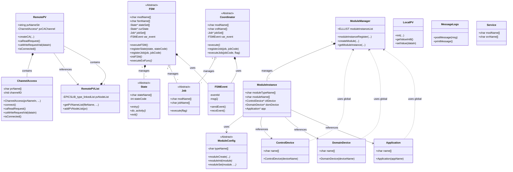

# UML Class Diagram - ooEpics Common

## Class Diagram

```mermaid
classDiagram
    %% Relationships
    ModuleManager "1" *-- "*" ModuleInstance : manages
    ModuleInstance --> ModuleConfig : uses
    ModuleInstance --> ControlDevice : references
    ModuleInstance --> DomainDevice : references
    ModuleInstance --> Application : references
    
    Application ..> ModuleManager : uses global
    ControlDevice ..> ModuleManager : uses global
    DomainDevice ..> ModuleManager : uses global
    
    RemotePV *-- ChannelAccess : contains
    RemotePVList "1" *-- "*" RemotePV : contains
    RemotePV --> RemotePVList : references
    
    FSM "1" *-- "*" State : manages
    FSM "1" o-- "*" Job : manages
    FSM *-- FSMEvent : uses
    
    Coordinator "1" o-- "*" Job : manages
    Coordinator *-- FSMEvent : uses
    
    %% Class Definitions
    class Application {
        +char name[]
        +Application(appName)
    }

    class ChannelAccess {
        -char pvName[]
        -chid channelID
        +ChannelAccess(pvNameIn, ...)
        +connect()
        +caReadRequest()
        +caWriteRequestVal(dataIn)
        +isConnected()
    }
    
    class ControlDevice {
        +char name[]
        +ControlDevice(deviceName)
    }
    
    class Coordinator {
        <<Abstract>>
        +char modName[]
        +char crdName[]
        -Job* jobSet[]
        -FSMEvent var_event
        +execute()*
        +registerJob(job, jobCode)
        +executeJob(jobCode, flag)
    }
    
    class DomainDevice {
        +char name[]
        +DomainDevice(deviceName)
    }
    
    class FSM {
        <<Abstract>>
        +char modName[]
        +char fsmName[]
        -State* stateSet[]
        -State* curState
        -Job* jobSet[]
        -FSMEvent var_event
        +executeFSM()
        +registerState(state, stateCode)
        +registerJob(job, jobCode)
        +initFSM()*
        +executeExtFunc()*
    }
    
    class State {
        <<Abstract>>
        +char stateName[]
        -int stateCode
        +entry()*
        +do_activity()*
        +exit()*
    }
    
    class FSMEvent {
        -eventId
        -msgQ
        +sendEvent()
        +recvEvent()
    }
    
    class Job {
        <<Abstract>>
        +char modName[]
        +char jobName[]
        +execute(flag)*
    }
    
    class LocalPV {
        +init(...)
        +getValueInt8()
        +setValue(dataIn)
    }
    
    class MessageLogs {
        +postMessage(msg)
        +printMessage()
    }
    
    class ModuleConfig {
        <<Abstract>>
        -char typeName[]
        +moduleCreate(...)*
        +moduleInit(module)*
        +moduleSet(module, ...)*
    }
    
    class ModuleManager {
        +ELLLIST moduleInstanceList
        +moduleInstanceRegister(...)
        +createModule(...)
        +getModuleInstance(...)
    }
    
    class ModuleInstance {
        +char moduleTypeName[]
        +char moduleName[]
        +ControlDevice* ctlDevice
        +DomainDevice* domDevice
        +Application* app
    }
    
    class RemotePV {
        +string pvNameStr
        -ChannelAccess* pvCAChannel
        +createCA(...)
        +caReadRequest()
        +caWriteRequestVal(dataIn)
        +isConnected()
    }
    
    class RemotePVList {
        -EPICSLIB_type_linkedList pvNodeList
        +getPVNameList(fileName, ...)
        +addPVNodeList(pv)
    }
    
    class Service {
        +char modName[]
        +char srvName[]
    }
```
